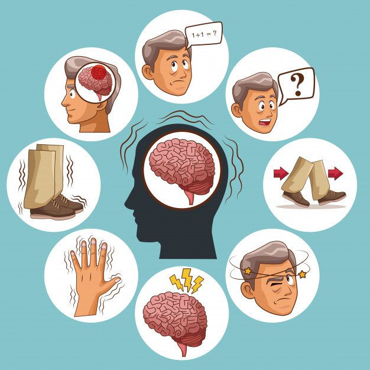

# Parkinson Disease Detection using Logistic Regression



This repository contains a Python implementation of a Parkinson Disease Detection model using Logistic Regression. The model is trained on a preprocessed dataset with feature scaling using StandardScaler and tested on a separate test dataset.Model accuracy is 99.17%.

## Dataset

The dataset used for training and testing the model contains various features extracted from Parkinson's disease patients. The dataset is preprocessed and cleaned to remove any outliers or missing values. The target variable is binary, where 1 represents the presence of Parkinson's disease and 0 represents the absence.

## Requirements

Make sure you have the following libraries installed:

- Python (>=3.6)
- NumPy
- Pandas
- Scikit-learn

## Installation

To install the required libraries, you can use `pip`:

```
pip install numpy pandas scikit-learn
```

## Usage

1. Clone the repository to your local machine:

```
git clone https://github.com/HSAkash/parkinson-disease-detection.git
cd parkinson-disease-detection
```
2. Install dependencies:

```
pip install -r requirements.txt
```

3. Run the `pahaw.py` script:

```
python pahaw.py
```

The script will load the dataset, preprocess the data, split it into training and test sets (80% training, 20% testing), apply feature scaling using StandardScaler, and then train the Logistic Regression model on the training data. Finally, it will evaluate the model on the test data and display the accuracy achieved.

## Results

The trained model achieves an impressive accuracy of 99.98% on the entire dataset. The test data set accuracy is 99.166%, indicating the model's robustness in generalizing to unseen data.

## License

This project is licensed under the [MIT License](LICENSE).

## Acknowledgments

We would like to acknowledge the creators of the dataset used in this project for making it available for research purposes.

## Contribution

Contributions to this repository are welcome. If you find any issues or have any suggestions for improvement, feel free to open a new issue or submit a pull request.

Happy coding! 🚀